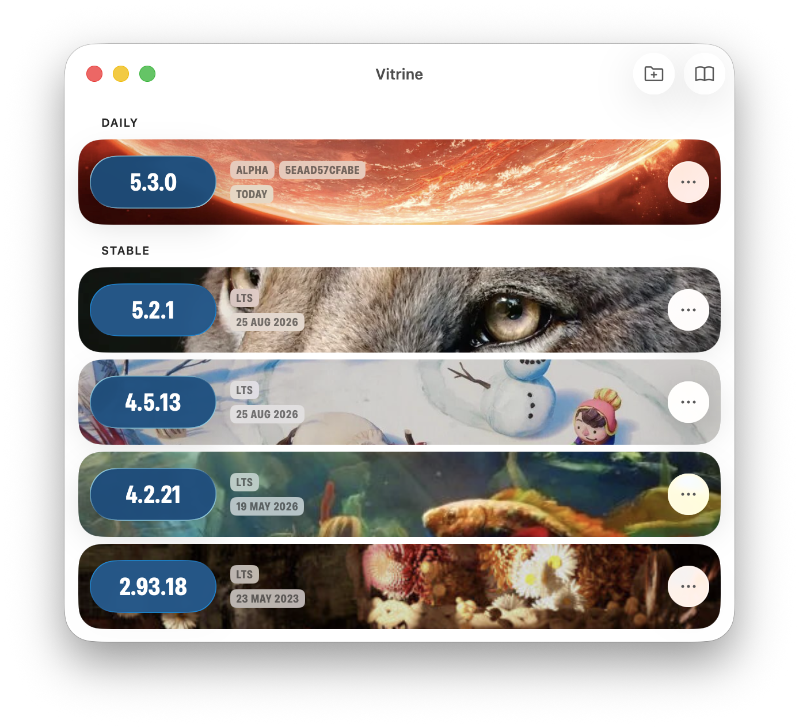
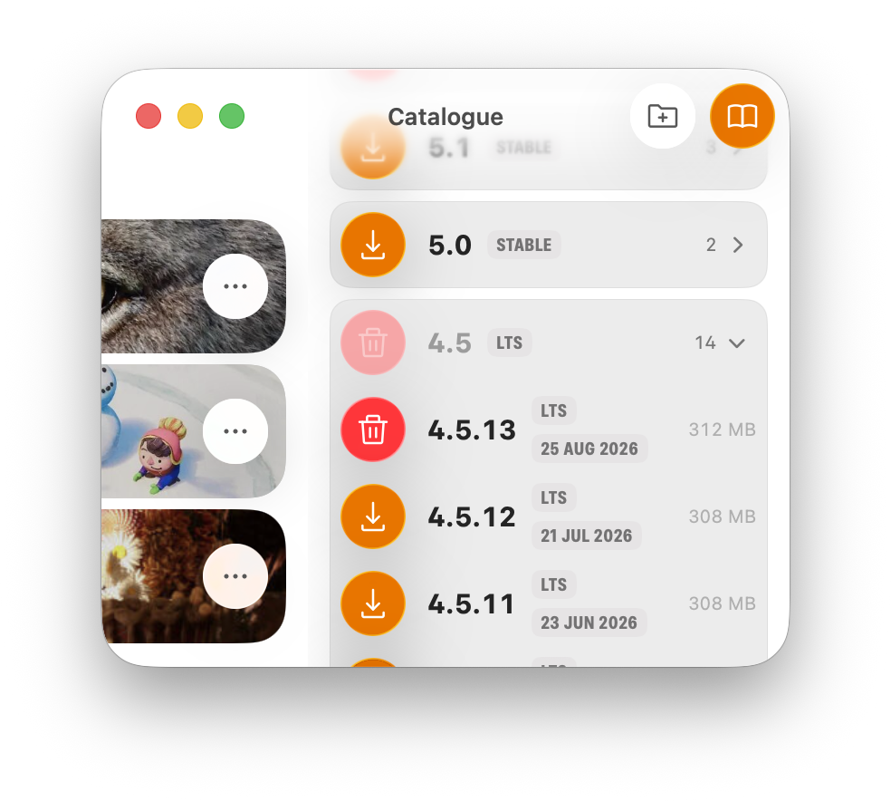
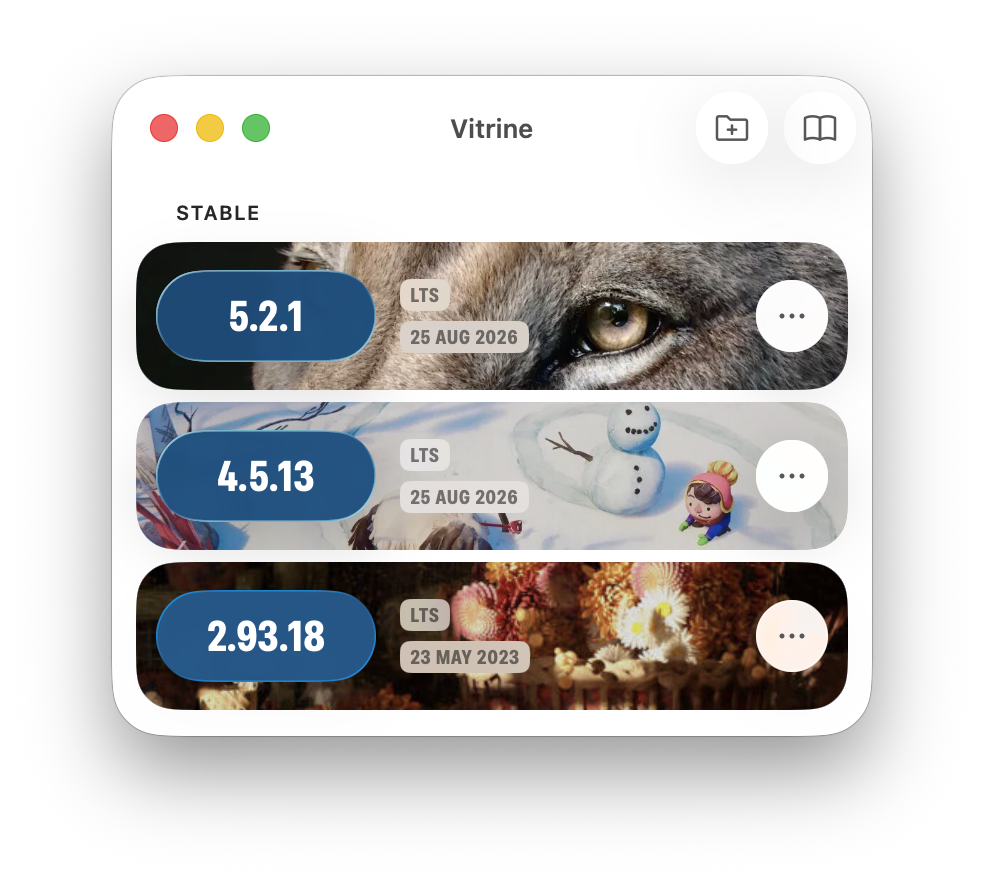

# Vitrine

*Designed by a human, programmed by Claude.*

A Blender build manager for macOS and Fedora. Browse and install different versions. Star a single version to use as your main Blender, used by the terminal and opened with .blend files.

I do not consider this quality software. It does what I need it to do, and I
use it, but it has had no testing worth mentioning beyond my own machine and my
own habits. No test matrix, no error handling I would defend, no hardening
against anything Blender Foundation might change tomorrow. Treat it as a UI/UX proof
of concept that happens to work, not as a tool you should rely on. The ideas
about how a version manager could look and feel is what I stand behind.

## Interface

<details>
<summary>Screenshots (macOS)</summary>







</details>

## Shape of the project

One core, two native front ends.

```
Sources/
  VitrineKit/     everything but the pixels — shared verbatim
  VitrineMac/     SwiftUI + AppKit
  VitrineLinux/   Adwaita for Swift (GTK 4 / libadwaita)
```

`VitrineKit` imports nothing but Foundation: the catalogue client, the
download and install pipeline, the library bookkeeping, `BuildStore` (the view
model both front ends drive), and a `PlatformIntegration` protocol holding the
handful of operations that genuinely differ — unpacking an archive, launching
a build, wiring the starred build into the desktop.

The front ends share no code and no widget vocabulary, because looking at home
on either desktop means using what that desktop already has: a unified title
bar and a real toolbar on macOS; a header bar and an overlay split view on
GNOME.

The catalogue floats over the library rather than splitting the window, so
opening it never resizes anything. Behind both sits the splash artwork of the
newest Blender release, and every library card wears its own release's
painting.

Those paintings ship with the app. `./splashes.sh` fills
`Sources/VitrineKit/Resources/Splashes/` with one per released series — the
social-preview image on each release's announcement page, since there is no
API for the artwork — and the app reads them from its own bundle. Nothing is
fetched when a build is installed; the scrape survives only as the fallback
for a series newer than the app itself. Daily builds get no painting of their
own, so they share one blurred backdrop.

The menu bar follows the system language — English, Dutch, Spanish, French,
Italian and Portuguese, in `Resources/Localizations/`, copied into the app by
`bundle.sh`. Declaring those in `Info.plist` is also what makes AppKit's own
menus (File, Window, Quit) arrive translated. The rest of the interface is
English for now.

There is no settings window on either platform. The app has one setting — how
far back to scrape the stable archive — and each front end puts it where that
desktop would: the View menu on macOS, the header bar's menu on GNOME. The
library folder is read from `settings.json`, which is plain JSON and meant to
be hand-edited.

`Package.swift` picks the front end. A package manifest is compiled and run on
the host, so `#if os(Linux)` there decides what a build on *this* machine even
sees. A macOS build therefore has no external dependencies at all, and a
Fedora build never touches AppKit. Both produce an executable named `Vitrine`.

### How the UI hears about a change

`BuildStore` is a plain `@MainActor` class with a `didSet` on every published
property, feeding one callback list. Front ends subscribe with
`observeChanges(_:)` and turn that into whatever their framework understands —
a SwiftUI invalidation on macOS, a bumped revision counter on GNOME.

It deliberately does not use the `@Observable` macro. Macro plugins run on the
build host, and the expansion Linux toolchains produce for `@Observable` has
known trouble; a `didSet` per property costs a line and behaves identically
everywhere.

## Building

### macOS

```bash
./bundle.sh release
```

Wraps the built executable in `Vitrine.app` with its Info.plist, icon and an
ad-hoc signature. `./bundle.sh` on its own does a debug build. `swift run`
also works — the Info.plist is linked into the binary so it launches as a real
GUI app.

Requires macOS 15 or later. No dependencies.

### Fedora

```bash
sudo dnf install swift-lang gtk4-devel libadwaita-devel
swift build -c release
```

`Adwaita` is fetched from
[AparokshaUI/adwaita-swift](https://github.com/AparokshaUI/adwaita-swift) and
links against the system libadwaita through pkg-config.

For an installed app rather than a binary in `.build/`, there is an RPM:

```bash
sudo dnf install rpm-build rpmdevtools desktop-file-utils libappstream-glib
./packaging/fedora/build-rpm.sh
```

It archives HEAD, builds it, and prints the finished package for
`sudo dnf install`. What lands on disk is the executable and its resource
bundle together under `/usr/libexec/vitrine`, a `vitrine` wrapper on PATH, and
the desktop entry, AppStream metadata and icons that put Vitrine in the
Activities overview.

The spec is not fit for the Fedora repositories, and says so at the top: the
build resolves adwaita-swift over the network, which Fedora's own build system
forbids, and the tree carries no licence to declare.

## Tests

```bash
swift test
```

Covers the shared core: version parsing and ordering, the byte and date
formatters (hand-rolled so macOS and Fedora print the same strings), and the
Linux unpack path, which only runs when the tests are built on Linux.

## Where things live

| Path | |
| --- | --- |
| `Sources/VitrineKit/BlenderAPI.swift` | catalogue fetch and parsing |
| `Sources/VitrineKit/Splash.swift` | splash artwork: the bundled set, and the fallback fetch |
| `Sources/VitrineKit/Resources/Splashes/` | one painting per released series, plus the daily backdrop |
| `Sources/VitrineKit/Installer.swift` | download → unpack → library layout |
| `Sources/VitrineKit/BuildStore.swift` | the view model both front ends drive |
| `Sources/VitrineKit/Platform/` | the per-OS half |
| `Sources/VitrineMac/Resources/Icons/` | SVG icon sources; the macOS target ships them as-is |
| `packaging/fedora/` | the RPM spec, desktop entry, AppStream metadata and icons |

Installed builds live under `⟨library⟩/⟨branch⟩/⟨build⟩/`, each with a
`.vitrine.json` beside it. The layout is self-describing: a fresh launch
rediscovers everything by walking the folder, so there is no manifest to fall
out of sync with the disk.
